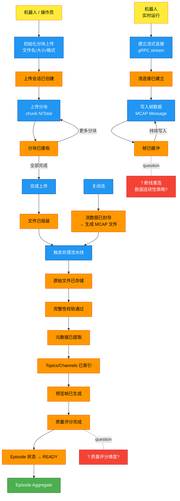
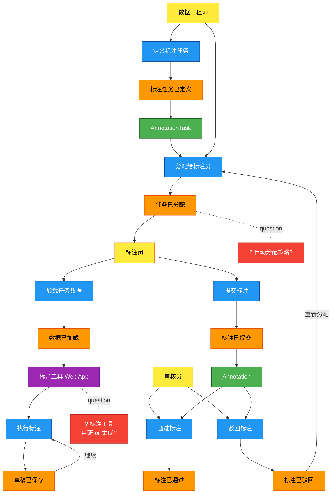
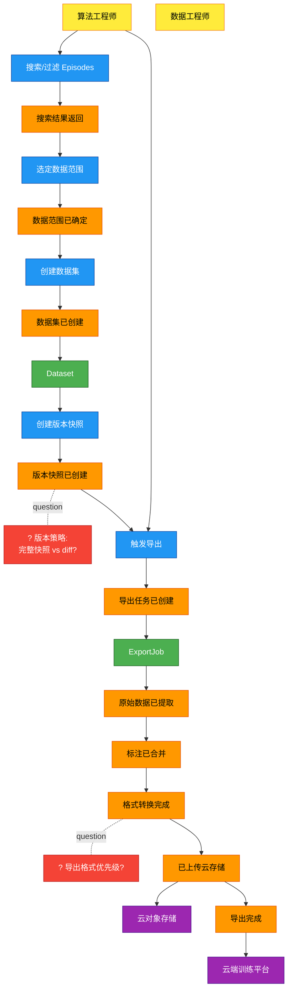
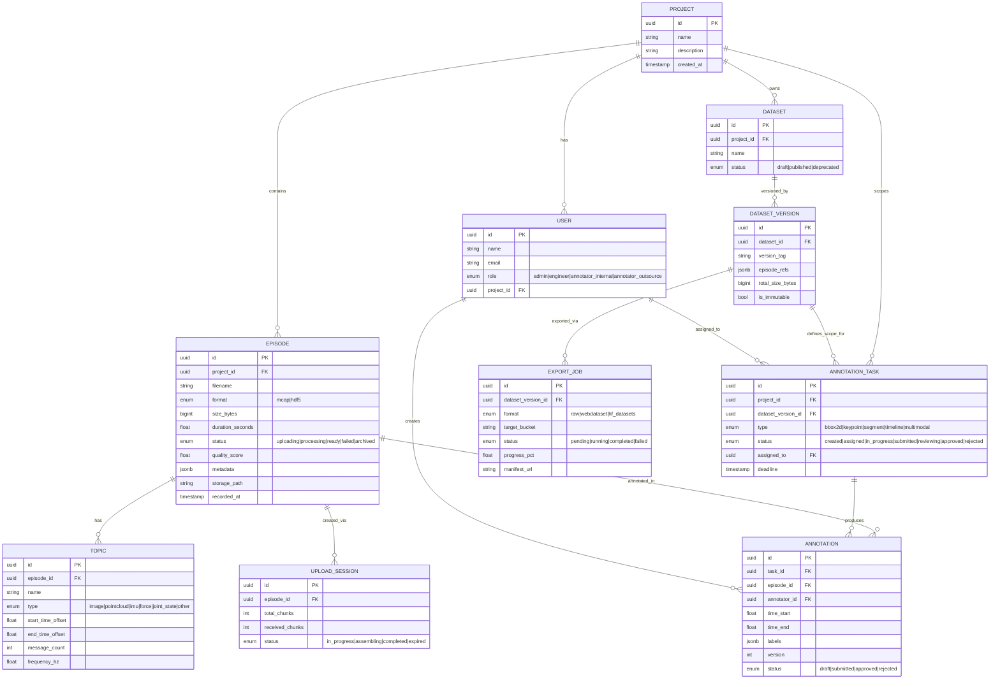
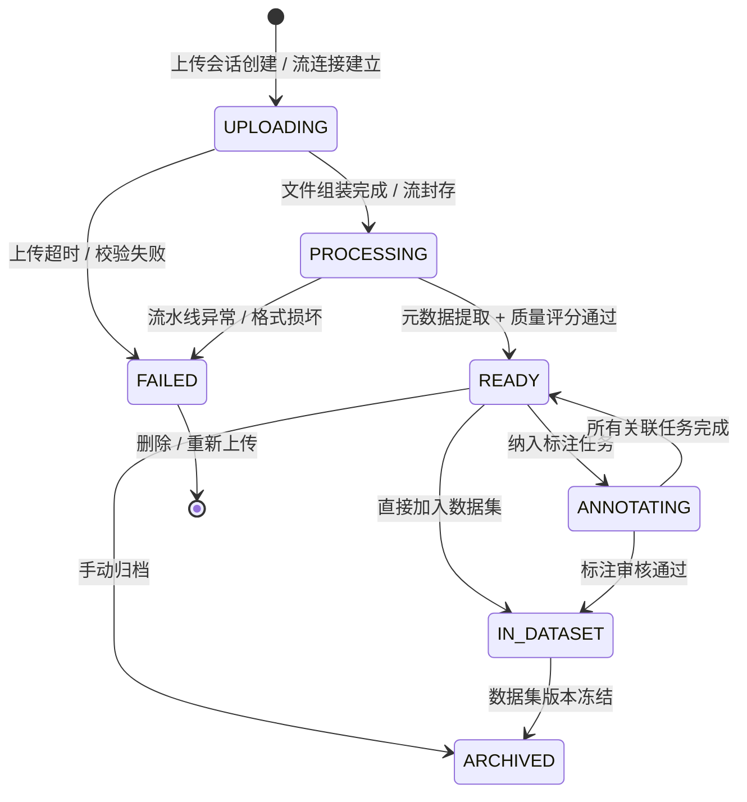
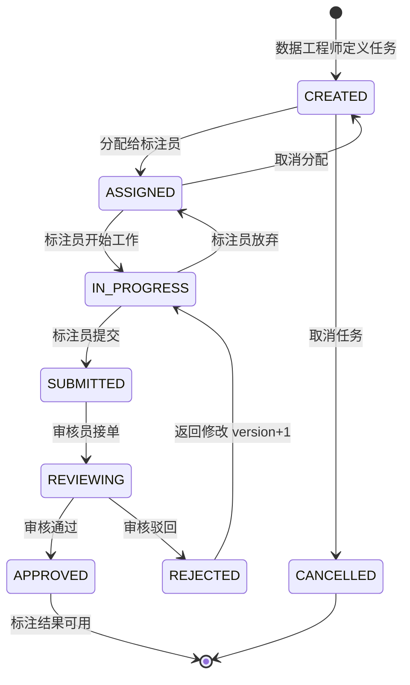
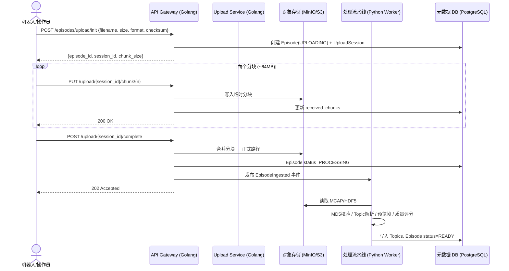
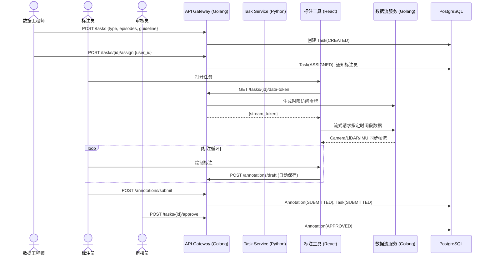
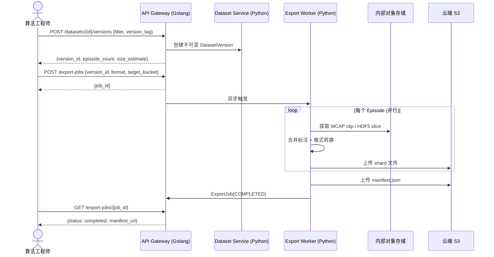

# EmbedAI DataHub — 设计目录

多模态数据管理平台（具身机器人领域），覆盖数据采集、处理、标注、数据集管理与训练导出全链路。

## 导航

| 文档 | 说明 |
|------|------|
| [需求文档](requirements.md) | 业务目标、角色、约束、成功标准 |
| [全局事件流](#全局事件流-big-picture) | EventStorming 大图 |
| [流程: 数据采集](#流程-数据采集) | 上传 + 实时流接入 |
| [流程: 标注](#流程-标注) | 任务创建 → 执行 → 审核 |
| [流程: 数据集导出](#流程-数据集导出) | 版本化 → 导出 → 云存储 |
| [实体关系图](#实体关系图-erd) | 核心数据模型 |
| [状态图: Episode](#状态图-episode) | 数据录制片段生命周期 |
| [状态图: 标注任务](#状态图-标注任务) | 标注任务状态机 |
| [时序: 文件上传](#时序-文件上传) | 分块上传 + 断点续传 |
| [时序: 标注工作流](#时序-标注工作流) | 端到端标注交互 |
| [时序: 导出任务](#时序-导出任务) | 异步导出到云存储 |
| [关键决策点](#关键决策点-hotspots) | 未定义的架构选择 |
| [技术栈建议](#技术栈建议) | 基于需求的选型推荐 |

---

## 全局事件流 Big Picture

```mermaid
flowchart LR
    classDef event fill:#ff9800,stroke:#e65100,color:#000
    classDef command fill:#2196f3,stroke:#0d47a1,color:#fff
    classDef actor fill:#ffeb3b,stroke:#f57f17,color:#000
    classDef system fill:#9c27b0,stroke:#4a148c,color:#fff
    classDef aggregate fill:#4caf50,stroke:#1b5e20,color:#fff
    classDef hotspot fill:#f44336,stroke:#b71c1c,color:#fff

    Robot[机器人/仿真器]:::actor
    DataEng[数据工程师]:::actor
    Annotator[标注员]:::actor
    Reviewer[审核员]:::actor
    MLEng[算法工程师]:::actor
    CloudStorage[云对象存储\nS3兼容]:::system
    TrainingPlatform[云端训练平台]:::system

    CmdUpload[上传 MCAP/HDF5]:::command
    CmdStream[开始实时流接入]:::command
    EvtFileReceived[文件已接收]:::event
    EvtStreamStarted[流接入已开始]:::event
    AggEpisode[Episode\n录制片段]:::aggregate

    Robot --> CmdUpload
    Robot --> CmdStream
    CmdUpload --> EvtFileReceived
    CmdStream --> EvtStreamStarted
    EvtFileReceived --> AggEpisode
    EvtStreamStarted --> AggEpisode

    EvtMetaExtracted[元数据已提取\nTopics/时长/传感器]:::event
    EvtQualityChecked[质量检查完成]:::event
    EvtEpisodeReady[Episode 可用]:::event
    HotQuality[? 质量检查规则\n如何定义?]:::hotspot

    AggEpisode --> EvtMetaExtracted
    EvtMetaExtracted --> EvtQualityChecked
    EvtQualityChecked -.question.- HotQuality
    EvtQualityChecked --> EvtEpisodeReady

    CmdCreateTask[创建标注任务]:::command
    CmdAssignTask[分配任务]:::command
    CmdSubmitAnno[提交标注]:::command
    CmdReview[审核标注]:::command
    EvtTaskCreated[标注任务已创建]:::event
    EvtTaskAssigned[任务已分配]:::event
    EvtAnnoSubmitted[标注已提交]:::event
    EvtAnnoApproved[标注已通过]:::event
    EvtAnnoRejected[标注已驳回]:::event
    AggTask[AnnotationTask]:::aggregate
    AggAnnotation[Annotation]:::aggregate
    HotTool[? 标注工具\n自研还是集成?]:::hotspot

    EvtEpisodeReady --> CmdCreateTask
    DataEng --> CmdCreateTask
    CmdCreateTask --> EvtTaskCreated
    EvtTaskCreated --> AggTask
    DataEng --> CmdAssignTask
    CmdAssignTask --> EvtTaskAssigned
    EvtTaskAssigned --> Annotator
    Annotator --> CmdSubmitAnno
    CmdSubmitAnno --> EvtAnnoSubmitted
    EvtAnnoSubmitted --> AggAnnotation
    Reviewer --> CmdReview
    CmdReview --> EvtAnnoApproved
    CmdReview --> EvtAnnoRejected
    EvtAnnoRejected -.retry.-> Annotator
    AggAnnotation -.question.- HotTool

    CmdCurateDataset[策划数据集]:::command
    CmdCreateVersion[创建版本快照]:::command
    EvtDatasetCreated[数据集已创建]:::event
    EvtVersionCreated[版本已创建]:::event
    AggDataset[Dataset 数据集]:::aggregate

    MLEng --> CmdCurateDataset
    DataEng --> CmdCurateDataset
    EvtAnnoApproved --> CmdCurateDataset
    CmdCurateDataset --> EvtDatasetCreated
    EvtDatasetCreated --> AggDataset
    DataEng --> CmdCreateVersion
    CmdCreateVersion --> EvtVersionCreated
    AggDataset --> EvtVersionCreated

    CmdExport[触发导出]:::command
    EvtExportStarted[导出任务已启动]:::event
    EvtExportDone[数据集已导出]:::event
    HotFormat[? 导出格式\n优先级?]:::hotspot

    MLEng --> CmdExport
    EvtVersionCreated --> CmdExport
    CmdExport --> EvtExportStarted
    EvtExportStarted --> CloudStorage
    CloudStorage --> EvtExportDone
    EvtExportDone --> TrainingPlatform
    EvtExportDone -.question.- HotFormat
```

---

## 流程: 数据采集

---

## 流程: 标注

---

## 流程: 数据集导出

---

## 实体关系图 ERD

---

## 状态图: Episode

---

## 状态图: 标注任务

---

## 时序: 文件上传

---

## 时序: 标注工作流

---

## 时序: 导出任务

---

## 架构决策 ADR

详见 [decisions.md](decisions.md)，以下为摘要：

| # | 决策点 | 决策 |
|---|--------|------|
| H1 | **质量评分维度** | 帧率稳定性(40%) + 传感器完整性(40%) + 信号质量(20%)；< 0.6 标记 low_quality，< 0.3 自动隔离 |
| H2 | **实时流断线重连** | 客户端 seq_num + 服务端 5s 滑动缓冲；断线 > 30s 封存当前片段，重连开新 Episode，通过 session_id 关联 |
| H3 | **标注工具** | MVP 集成 Label Studio（自托管）；通过 REST API + Webhook 与平台双向同步；中期评估自研时序查看器 |
| H4 | **任务分配** | 默认手动分配（展示实时负载辅助决策）；预留 `mode=auto`（skill_tags 匹配 + 最少任务数优先），后续按需启用 |
| H5 | **数据集版本** | 引用快照：存 `{episode_id, clip_start, clip_end, topic_filter}`，不复制原始文件；版本创建后不可变 |
| H6 | **导出格式** | P0: WebDataset shard（200-500MB/shard）+ 裸文件/JSON sidecar；P1: HuggingFace Parquet（HDF5 场景） |

---

## 技术栈建议

| 层 | 组件 | 技术选型 | 理由 |
|----|------|----------|------|
| API 网关 | HTTP + gRPC | **Golang (Gin/gRPC)** | 高并发上传/流接入，低延迟 |
| 业务服务 | Task / Dataset / Export | **Python (FastAPI)** | 丰富的 MCAP/HDF5 生态 |
| 元数据存储 | 关系型 DB | **PostgreSQL + JSONB** | 灵活的 metadata 查询 |
| 原始数据存储 | 对象存储 | **MinIO** (本地 TB 级) | S3 兼容，自托管 |
| 消息队列 | 异步流水线触发 | **Redis Streams** 或 **NATS** | 轻量，适合 TB 级初期规模 |
| 处理流水线 | Worker | **Python + mcap SDK + h5py** | 直接利用官方 SDK |
| 前端 | Web App | **React + TypeScript** | 已定，推荐 TanStack Query + Zustand |
| 标注工具 (MVP) | 集成 | **Label Studio** (开源) | 支持视频/时序，有 REST API |
| 搜索 | Episode 全文+属性 | **PostgreSQL FTS** 或 **Meilisearch** | 初期 PG 够用 |
| 认证 | 用户/权限 | **Keycloak** 或 JWT + RBAC | 支持外包用户隔离 |
